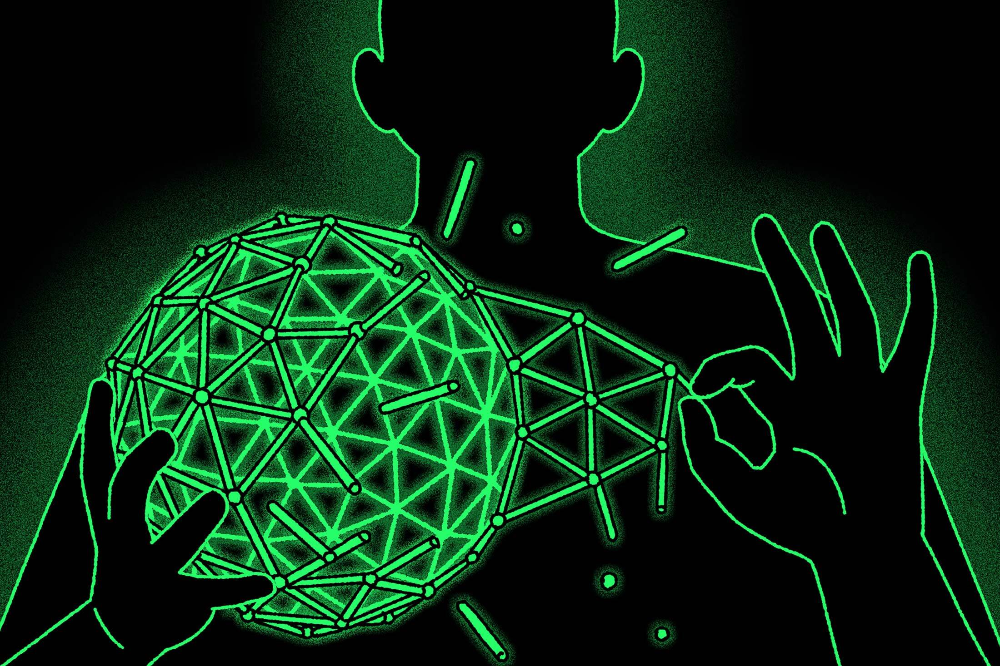

#  Research Paper on Emerging Threats and Countermeasures
## **Introduction**
With technology advancing so quickly, cybersecurity is facing unheard-of difficulties. Network security is becoming more and more vulnerable to new threats, such as blockchain exploitation, AI-driven assaults, and weaknesses in quantum computing. Network security is essential for protecting digital assets. Each of these risks takes use of new developments in technology to possibly interfere with, alter, or compromise sensitive information and systems. A thorough understanding of these threats' mechanisms and the creation of robust remedies to safeguard digital infrastructure are necessary for an effective defense against them.
## **1) AI-Driven Attacks**

Artificial intelligence (AI) is a two-edged sword in cybersecurity since it benefits both defenders and attackers. On the offensive, AI allows opponents to carry out sophisticated, highly targeted strikes. AI-driven malware, for example, can dynamically adapt its code to avoid standard antivirus detection. Machine learning can also be used to examine large datasets, revealing trends that can be used to create convincing phishing emails aimed to manipulate human psychology, improving the success rate of social engineering assaults.

**Advanced AI-Driven Malware:** Because AI-driven malware uses machine learning to adapt and adjust behaviour in real time, traditional signature-based detection becomes ineffective. To prevent detection, this complex malware uses code obfuscation, polymorphism, and metamorphism. 

**AI-Enhanced Phishing Attacks:** Attackers use AI to evaluate large volumes of personal data, resulting in highly tailored phishing emails that can fool even the most alert recipients. This kind of automation enables large-scale phishing campaigns with little human interaction.
##### **Countermeasures**
Defending against AI-driven attacks requires leveraging AI for defense. Machine learning algorithms can examine network data in real time and detect odd behaviour that indicates malicious activities. These systems excel at spotting abnormalities that static rule-based systems frequently overlook. Furthermore, AI-powered incident response platforms can quickly filter warnings, distinguishing between false positives and serious threats to enable speedier remediation.
##### **Recommendations**
Implement AI-powered anomaly detection systems to continuously monitor network activity and detect breaches in real time. 
Implement regular cybersecurity training programs that emphasize understanding of AI-enhanced social engineering strategies. 
Create a security-conscious culture that promotes reporting and discussing questionable conduct.
## **2) Quantum Computing Vulnerabilities**

With its unparalleled computational capacity, quantum computing holds the potential to resolve issues beyond the capabilities of traditional computers. This ability puts the cryptographic techniques that now protect digital communications in grave danger. If businesses don't change their encryption techniques, quantum computers may be able to crack public-key cryptography techniques like RSA and ECC, resulting in massive data breaches.

**Possible Effect on Public-Key Cryptography:** Because of their enormous processing capability, quantum computers pose a danger to current encryption standards like RSA and ECC, which could be broken and reveal encrypted data. 

**Impact on Confidentiality and Integrity:** Failure to abide by present cryptographic standards could have disastrous repercussions, such as data breaches and the creation of digital signatures, jeopardizing the confidentiality and integrity of vital systems.
##### **Countermeasures**
Post-quantum cryptography research tries to design encryption methods that are resistant to quantum attacks. These algorithms are based on challenges that quantum computers are unlikely to solve readily, guaranteeing that data is secure even in the quantum era. In addition, enterprises should use hybrid encryption systems that combine classical and quantum-resistant algorithms to assure compatibility and security. 
##### **Recommendations**
Begin evaluating and moving to post-quantum cryptography standards, prioritizing systems that handle the most sensitive data. 
Join industry groups dedicated to quantum-safe cryptography to remain up to date on the most recent developments and guidelines. 
Conduct regular security audits to discover and upgrade susceptible systems before quantum computing achieves its full potential.
## **3) Blockchain Exploitation**

Despite being praised for facilitating safe and open digital transactions, blockchain technology is not impervious to online attacks. Automating agreements, smart contracts are vulnerable to code errors that could be used against them financially. Furthermore, 51% attacks put decentralized networks' integrity in danger by giving bad actors access to and manipulation of transaction history. 

**Vulnerabilities in Smart Contracts:** Smart contracts may include coding errors that hackers can take advantage of to alter transactions, possibly resulting in large losses of money or illegal access.

**51% Attack:** A 51% attack in a decentralized network is when a single party controls most of the network's processing power, giving them the ability to change transaction histories or double-spend currencies.

##### **Countermeasures**
Decentralized systems and stringent audits are needed to guarantee the security of blockchain networks and smart contracts. Regular code audits can find weaknesses in smart contracts before they are used against them, especially when combined with formal verification approaches. Improving decentralization is another way to strengthen the security of the blockchain network and keep a single organization from obtaining majority control.
##### **Recommendations**
To make sure smart contracts are secure, include formal verification techniques in the development process. 
To improve network resilience and thwart centralization, use decentralized consensus techniques. 
Implement security measures to lessen the impact of assaults, such as transaction rate limitations and multi-signature wallets.
## **Conclusion**
Network security risks are dynamic, need constant monitoring and adjustment. Some of the biggest threats facing digital infrastructure today are blockchain exploitation, AI-driven attacks, and vulnerabilities in quantum computing. Organizations may strengthen their resilience and safeguard their networks from these dynamic attacks by creating thorough countermeasures and encouraging a proactive security culture.

#### References
[1] https://link.springer.com/chapter/10.1007/978-3-642-13708-2_30

[2] https://nyaspubs.onlinelibrary.wiley.com/doi/abs/10.1111/nyas.13085

[3] https://www.tandfonline.com/doi/full/10.1080/08839514.2022.2037254

[4] https://www.sciencedirect.com/science/article/pii/S2590005621000138

[5] https://cryptodeep.ru/doc/Security_threats_on_Blockchain_and_its_countermeasures.pdf

[6] https://link.springer.com/article/10.1007/s11042-020-09368-6

